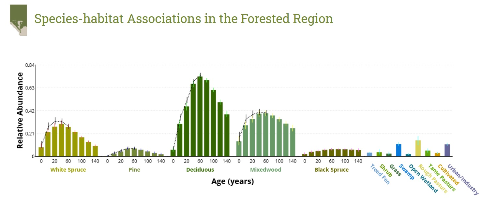
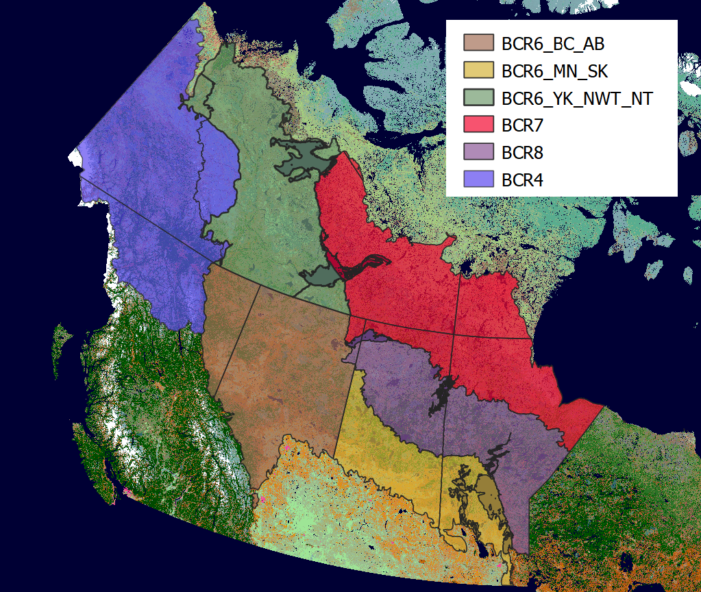

```{r setup, include=FALSE}
knitr::opts_chunk$set(echo = TRUE)
```

## Introduction

Ecosystems are complex and highly integrated entities that are defined by assemblages of species, the physical environment, and the processes that regulate them. Vegetation heterogeneity has a strong influence on the diversity and distribution of other species.  

The complexity and heterogeneity of the land cover and vegetation in the Western Boreal Project area creates challenges in effective modeling due to finite data resources. In order to draw well substantiated conclusions on the diversity and abundance of bird species across the region based upon underlying land cover it is necessary to categorize land cover into broad land cover and age classes to avoid spreading the data on bird/vegetation relationships too thin. A successful example of this comes from the Alberta Biodiversity Monitoring Institute (ABMI), as shown in Figure 1.  



As the study area of the Western Boreal Project is so large, and therefore includes a large amount of variation in the predominant vegetation communities found, it was decided that the area should be divided into several sub-regions, so as to allow each region to be examined based on the most appropriate land cover classification system. We therefore aimed to:

    1) determine an appropriate manner in which to divide the Western Boreal Project study area into sub-regions for the purposes of the project, and 
    2) to delineate a set of appropriate, ecologically meaningful land cover categories and age classes for each region. 


## Methods

We carried out an extensive review of both material describing the vegetation found in the region of interest, and the methods used to classify the different cover classes. Based on this we listed the species and species assemblages described and used for vegetation categorization within potential sub-subregions of interest for this project. As the project is to be focused largely around birds, we was decided that it would make most sense to form sub-regions from grouping Bird Conservation Region (BCR) and Province boundaries within the study area. From this, we determined firstly, which potential BCR/Province groupings had the most similarities and would allow available bird data coverage from the Boreal Avian Modelling Project to be equitably divided, and then, once sub-regions were determined, which land cover classes were most vital in each one.  

Documents reviewed included peer-reviewed articles (Fiera, 2013), reports on Canada's forest inventory (Power & Gillis 2006), provincial inventory system methodology and land classification reports (Forest Management Branch 2006, The Forestry Corp 2004, Ecological Land Classification Working Group 2009, Forest Resources 2006, Ministry of Forests, Lands and NRO 2012 and Saskatchewan Environment 2004), Ecozone and Ecoregion descriptions from the Ecological Framework of Canada (1995) and descriptions of methods used in the Common Attribute Schema (CAS) for Forest Inventories Across Canada (Cosco, J. A, 2020). LCC 2005 data was divided into the sub-regions, and the number of pixels in each of the land cover classes was plotted (SOURCE!!).  


## Results

### Sub-regions

It was decided that the most suitable manner of dividing the study area into sub-regions was to maintain the BCR's within the Western Boreal study area as undivided units with the exception of BCR 6, which was split into three sub-regions: the northern area in Yukon, the Northwest Territories and Nunavut, the western area in British Columbia and Alberta, and The eastern area in Saskachewan and Manitoba (Figure 2).  




### Land Cover Classes

In each of the sub-regions, the distribution of LCC2005 Land Cover Classes was as follows: 


Based on these histograms, and our literature review of vegetation groupings, we determined that the following categories should be included for each sub-region.

#### BCR6 in Yukon, Northwest Territories and Nunavut

#### BCR6 in British Columbia and Alberta

#### BCR6 in Saskatchewan and Manitoba

#### BCR4

#### BCR7

#### BCR8


### Ages classes for forested areas


## Bibliography

Alberta Biodiversity Monitoring Institute and Boreal Avian Modelling Project. 2019. Ovenbird (Seiurus aurocapilla). ABMI Website: abmi.ca/home/data-analytics/biobrowser-home/species-profile?tsn=726205.

BAM 

Cosco, J. A. 2020. Common Attribute Schema (CAS) for Forest Inventories Across Canada. https://github.com/edwardsmarc/CASFRI/tree/master/docs/specifications [Accessed 03/12/2020]

The Ecological Framework of Canada.  http://ecozones.ca/english/ [Accessed 03/12/2020]

Environment Yukon. 2016. Flynn, N. and Francis S., editors. Yukon Ecological and Landscape Classification and Mapping Guidelines. Version 1.0. Whitehorse (YT): Department of Environment, Government of Yukon.

Fiera (Fiera Biological Consulting Ltd.). 2013. Terrestrial Biodiversity Monitoring & Effects Assessment of Landbirds in the Oil Sands Area – 2013 Summary Report. Edmonton, Alberta. Fiera Biological Consulting Report #1256 

Forest Management Branch. 2006. Yukon Vegetation Inventory Manual, Version 2.1. https://emrlibrary.gov.yk.ca/forestry/yukon_vegetation_inventory_manual_2006.pdf [Accessed 03/12/2020]

Forest Resources. 2006. Northwest Territories Forest Vegetation Inventory Standards with Softcopy Supplements. V. 3.0. Forest Management Division, Dept. of ENR. 

The Forestry Corp. 2004. FLI User Guide, Prepared for Louisiana Pacific Canada Ltd. and Manitoba Conservation. 11302-119 Street Edmonton, AB 

Government of Canada. 2017. Bird Conservation Regions and strategies. https://www.canada.ca/en/environment-climate-change/services/migratory-bird-conservation/regions-strategies.html [Accessed 07/12/2020]

Latifovic, R. et al. 2008. Land cover map of Canada 2005 at 250m spatial resolution. Natural Resources Canada/ESS/Canada Centre for Remote Sensing. ftp://ftp.ccrs.nrcan.gc.ca/ad/NLCCLandCover/LandcoverCanada2005_250m/.

Ministry of Forests, Lands and NRO. 2012. VRI Relational Data Dictionary (Version 4.0).

Power, K., Gillis, M. 2006. Canada's Forest Inventory 2001. Natural Resources Canada, Canadian Forest Service, Pacific Forestry Centre, Victoria, BC. 

Resource Information Management Branch, Alberta Sustainable Resource Development. 2005. Alberta Vegetation Inventory Interpretation Standards: Chapter 3- Vegetation Inventory Standards and Data Model Documents. V. 2.1.1. Edmonton, AB.

Saskatchewan Environment. 2004. Saskatchewan Forest Vegetation Inventory. Forest Service Saskatchewan Environment, Box 3003, Prince Albert, SK, Canada S6V 6G1

