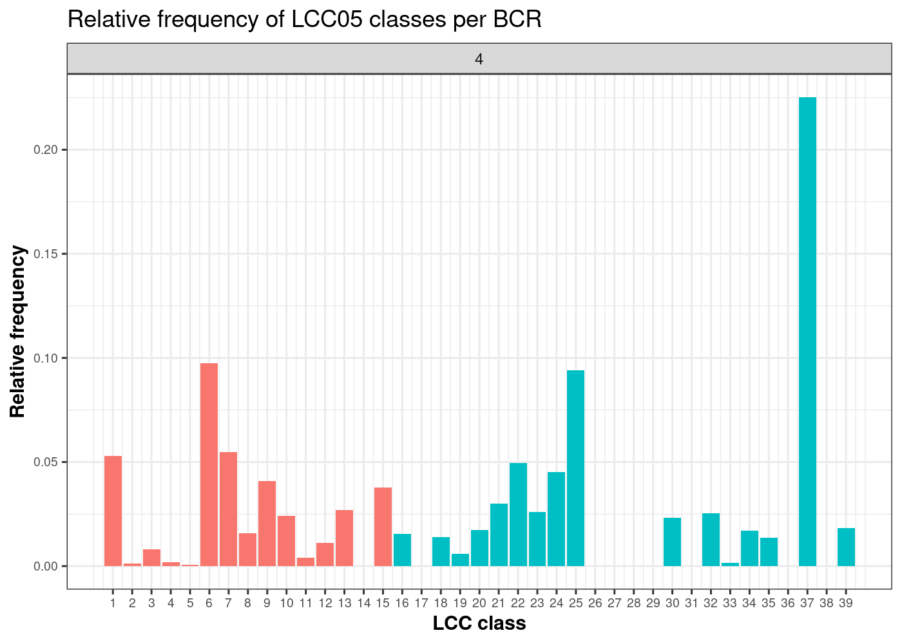
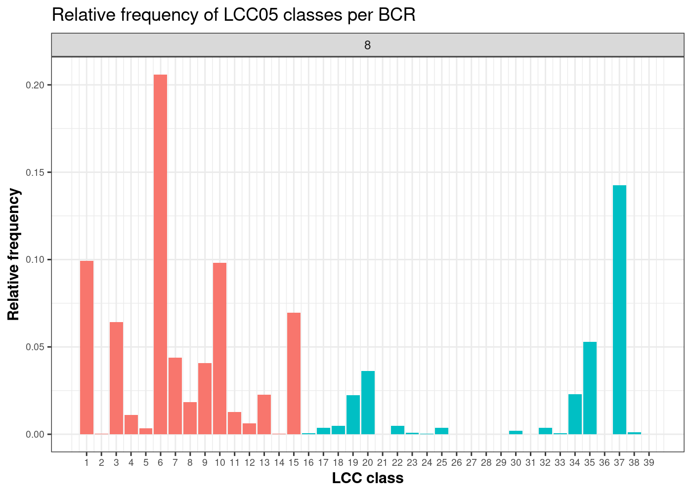
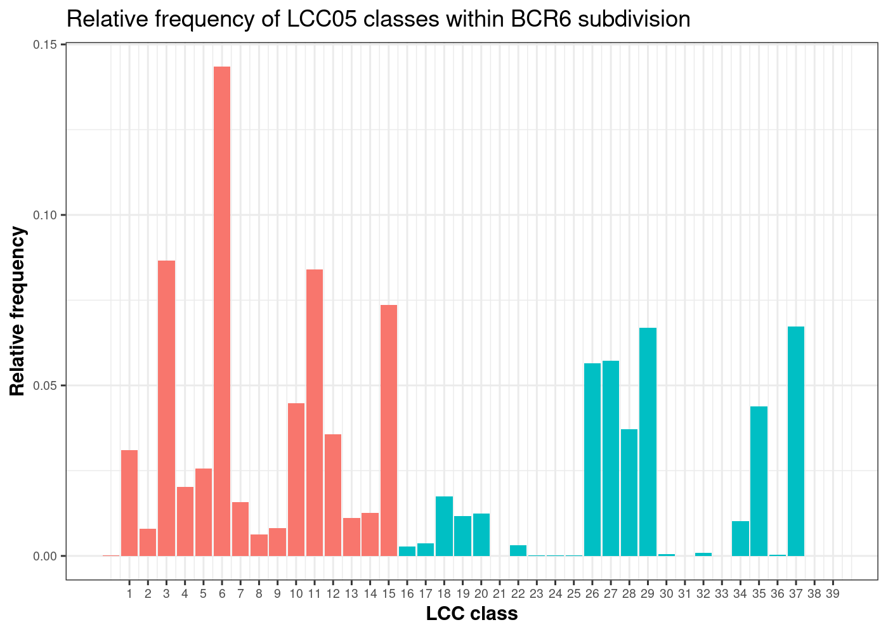
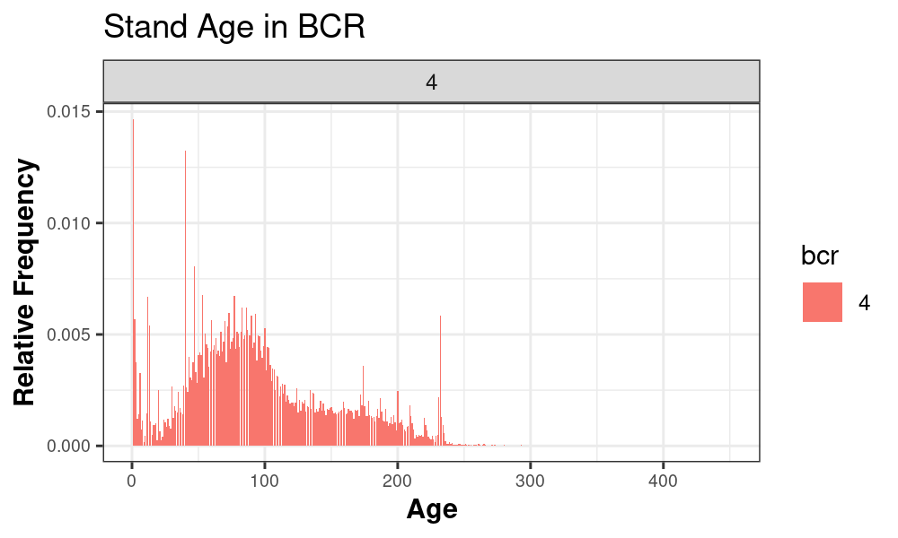
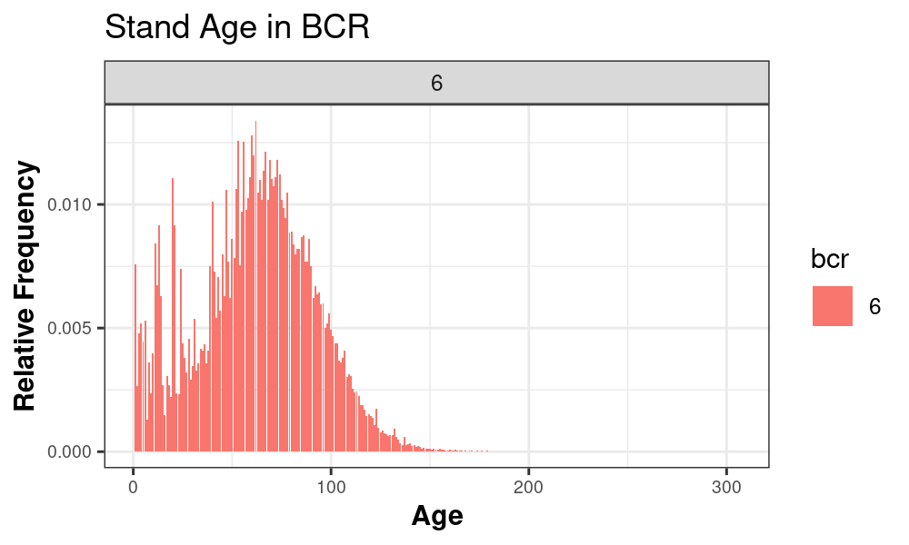

```{r setup, include=FALSE}
knitr::opts_chunk$set(echo = FALSE, fig.align = "center", knit.duplicate.label = "allow")
#rmarkdown::render("WB_LandCoverClasses_pdf.Rmd", output_format = c("html_document", "pdf_document"))
```


\newpage

# Introduction

Ecosystems are complex and highly integrated entities defined by assemblages of species, the physical environment, and the processes that regulate them. Vegetation heterogeneity has a strong influence on the diversity and distribution of other species. Structurally complex habitats may provide more niches and different ways of exploiting the environmental resources and thus increase species diversity [@tews2004; @lawler2004].  


The complexity and heterogeneity of the land cover and vegetation in the Western Boreal Project area creates challenges in effective modeling due to finite data resources. In order to draw well-substantiated conclusions on the diversity and abundance of bird species across the region based upon the underlying land cover it is necessary to categorize land cover into broad land cover and age classes to avoid spreading the data on bird/vegetation relationships too thin. A successful example of this comes from the Alberta Biodiversity Monitoring Institute (ABMI), as shown in Figure \@ref(fig:oven) [@albertabiodiversitymonitoringinstitute2019]. 


```{r oven, fig.cap = "Example of species-habitat associations for Ovenbird from the AMBI and Boreal Avian Modeling Project.", out.width="90%"}
knitr::include_graphics("figures/ABMIExample.jpg")
```

The Western Boreal Project (WBP) study area is large and it includes a significant heterogeneity of plant communities. However, specific characteristics are shared among the different provinces as established by the Ecological Framework of Canada [-@zotero-20]. Considering this information, it was decided that the study area should be divided into several sub-regions, to allow each region to be examined based on the most appropriate land cover classification system. 
 We, therefore, aimed to:
 
   *1) Determine an appropriate manner in which to divide the Western Boreal Project study area into sub-regions.* and
   
   *2) Delineate a set of appropriate, ecologically meaningful land cover categories and age classes for each sub-region.*

# Methods

We carried out an extensive literature review of both materials describing the vegetation found in the study area and the methods used to classify the different cover classes. The provincial forest inventories allowed us to list the species and species assemblages described and used for vegetation categorization within potential sub-regions of interest for this project, and the age classes most commonly used  [@theforestrycorp2004; @saaskatchewanenvironment2004; @resourceinformationmanagementbranch.albertasustainableresourcedevelopment2005; @forestresources2006; @lisgo2008; @forestmanagementbranch2016]. The studies at national level allowed us to corroborate the hierarchical vegetation categorization of forested lands and the different ways in which stand age is classified [@power2006; @cosco2011].

As the main objective of the project is focused on birds, we used Bird Conservation Regions (BCR) and the Province boundaries to obtain a sub-region division of the study area [@environmentcanada2013]. From this, we determined firstly, which potential BCR/Province groupings had the most similarities and would allow available bird data coverage from the Boreal Avian Modelling Project (BAM) to be equitably divided, and then, once sub-regions were determined, which land cover classes were most important in each one [@cumming2010; @barker2015].  

The land cover classification classes for each sub-region were obtained by using the Land Cover Classification of Canada 2005 [@latifovic2008]. Stand age was obtained from Natural Resources Canada[@beaudoin2017a].

# Results

## Sub-regions
The Western Boreal study area was divided into sub-regions following the BCR boundaries, with the exception of BCR 6, given its extention and vegetation hetergenity, it was split into three sub-regions: the northern area in Yukon, the Northwest Territories and Nunavut, the western area in British Columbia and Alberta, and the eastern area in Saskachewan and Manitoba (Fig.\@ref(fig:area)).  

```{r area, echo = FALSE, fig.cap = "Western Boreal Project sub-regions", out.width="60%"}
knitr::include_graphics("figures/WB_LandCoverRegions.PNG")
```
    

## Land Cover Classes

In each of the sub-regions, the relative frequency of Land Cover Classes was as follows: 
```{r bcr4, fig.cap = "Relative frequency of Land Cover Classes for BCR's 4, 7, and 8, respectively.", fig.show ='hold', out.width="60%"}
par(mar = c(4, 4, .1, .1))

knitr::include_graphics("figures/lcc/LCC_BCR7prop.png")

```

```{r bcr6, fig.cap = "Relative frequency of Land Cover Classes for BCR 6.", out.width="60%"}

knitr::include_graphics("figures/lcc/LCC_BCR6_MBSKprop.png")

```

```{r bcr7, fig.cap = "Relative frequency of Land Cover Classes for BCR 7", out.width="60%"}
knitr::include_graphics("figures/lcc/LCC_BCR7prop.png")
```

```{r bcr8, fig.cap = "Relative frequency of Land Cover Classes for BCR 8", out.width="60%"}

```


Based on the relative frequency of land cover classes and our literature review of vegetation groupings, we determined that the following categories should be included for each sub-region.

```{r table}
# ABBCURL <- paste0("https://drive.google.com/file/d/",
# "1mW1kyGgy9bxpI7yrAJ7DPe7QJXRx11JI/view?usp=sharing")
#   
# vegClassABBC <-  reproducible::prepInputs( 
#                                       destinationPath = "inputs",
#                                       url = ABBCURL,
#                                       fun = "read.csv",
#                                       overwrite = TRUE)
# 
# knitr::kable(vegClassABBC, caption = "An example")
```

## BCR 6 in British Columbia and Alberta

Table: (\#tab:ABBC) Vegetation type description for BCR 6:*British Columbia and Alberta*. Modified from Mahon(-@mahon2016).

| Vegetation Type | Description |
|-|-|
| Pine dominant | Upland. Stands where combined jack pine and lodgepole pine are the leading species and  deciduous species comprise less than 20% |
| Black spruce | Upland. Stands where black spruce is the leading species, the soil regime is  dry or mesic and larch = 0% or stands where black spruce is the leading species,  the soil regime is wet and the combined species trembling aspen + balsam poplar +  balsam fir + jack pine more than 0% |
| White spruce | Upland. Stands where combined white spruce and balsam fir comprise more than 80% |
| Deciduous | Upland. Stands where combined trembling aspen, balsam poplar,  and white birch comprise more than 80%.  Mesic(M) and hygric (W) stands are differentiated |
| Mixedwood | Upland. Stands where deciduous more than 20% and combined conifer species (jack pine, lodgepole pine, white spruce, balsam fir, and black spruce more than 20%.  Mesic(M) and hygric (W) stands are differentiated |
| Wetland | Lowland-wetland. Stands where black spruce is the leading species and the soil regime  is aquatic or stands where black spruce is the leading species,  the soil regime is mesic and larch more than 0 or stands where black spruces  is the leading species, the soil regime is wet and the combined species: trembling aspen + balsam poplar + balsam fir + jack pine = 0 |

## BCR6 in Northwest Territories 

Table: (\#tab:NWT) Vegetation type description for BCR 6:*Northwest Territories*.

|Vegetation Type| Description|
|---------------|-------------|
|Spruce dominant| black/white   |
|Pine dominant | jack pine       |
|Deciduous dominant| trembling/black aspen|
|Coniferous mix| usually spruce/pine|
|Coniferous/deciduous mixedwood|     | 
|Other hardwoods| green aspen/Manitoba maple/oak


## BCR 6 in Saskatchewan and Manitoba

Table: (\#tab:SKMB) Vegetation type description for BCR 6:*Saskatchewan and Manitoba*.

|Vegetation Type| Description|
|---------------|-------------|
|Spruce dominant| black/white   |
|Pine dominant | jack pine       |
|Deciduous dominant| trembling/black aspen|
|Coniferous mix| usually spruce/pine|
|Coniferous/deciduous mixedwood|     | 
|Other hardwoods| green aspen/Manitoba maple/oak

## BCR 4
Table: (\#tab:4) Vegetation type description for BCR 4.

|Vegetation Type   | Description |
|------------------|-------------|
|Spruce/Fir dominant | Spruce and fir stands where the combined spruce and fir component is 80% or more |
|Pine dominant | Lodgepole or jack pine stands where the pine component is 80% or more |
|Deciduous dominant | Stands where the deciduous tree component is 80% or more |
|Coniferous mix | Coniferous trees component is 80% or more |
|Coniferous/deciduous mix | Mixed stands where neither deciduous or coniferous component is 80% or more | 

## BCR 7 and BCR 8

Table: (\#tab:8) Vegetation type description for BCR 7 and 8.

|Vegetation Type| Description|
|---------------|-------------|
|Spruce dominant| black/white   |
|Pine dominant | jack pine       |
|Deciduous dominant| trembling/black aspen|
|Coniferous mix| usually spruce/pine|
|Coniferous/deciduous mixedwood|     | 
|Other hardwoods| green aspen/Manitoba maple/oak

## Ages classes for forested areas

Power (2006) reported and age class of more than 401 years for British Columbia. Howewer, the oldest stand age found in the study area was 400 years in BCR 4 Fig.\@ref(fig:ages). The Province Forest Inventories consistenly use 10-yr age classes,thus the present study will use the same approach.The maximum age class will be 191-200 or possible as young as 141-150. 


```{r ages, fig.cap="Age Frequency for BCR 4, 6, 7 and 8.", out.width="50%"}

par(mar = c(4, 4, .1, .1))


knitr::include_graphics("figures/age/BCR7_age.png")
knitr::include_graphics("figures/age/BCR8_age.png")

```


\newpage

## References

